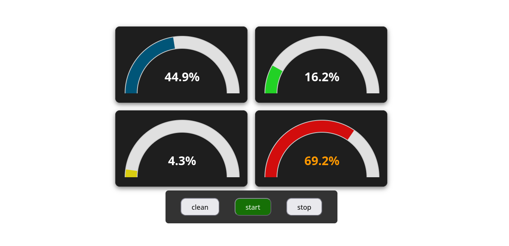
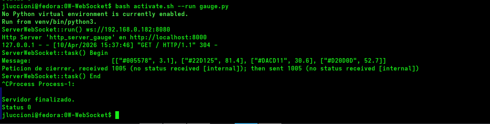
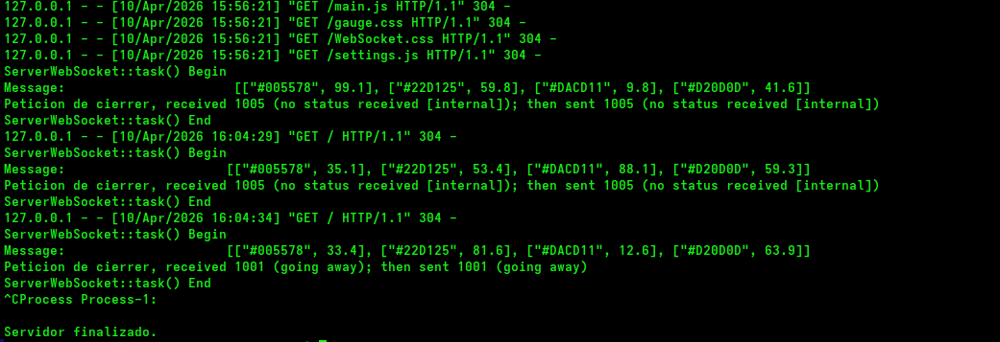

# WebSocket Gauge
Servidor WebSocket para ser consumido por clientes que dispongan de indicadores del tipo Gauges (FrontEnd).

Estructura del proyecto:

```bash
├── http_server_gauge
│   ├── constants.js
│   ├── gauge.css
│   ├── index.html
│   ├── main.js
│   ├── settings.js
│   └── WebSocket.css
├── gauge.py
├── activate.sh
├── requirements
│   └── requirements.txt
├── readme
│   └── img
│       ├── consola_servers_close_01.png
│       ├── consola_servers_ups_01.png
│       └── gauge_01.png
└── readme.md
```
1. Directorio `http_server_gauge`, representa el FronEnd en JavaScript.
2. `gauge.py` es el backend en python todo en un solo script.
3. `activate.sh` shell script con las seceuncias de comando para facilitar el despliegue del proyecto usando virtual Environment.
4. `requirements` directorio con los archivos relacionado a las dependencias del proyecto.
5. `readme` directorio con los complementos (imagenes) para este readme `readme.md`.


+ [**Preparacion del entorno en linux**](#preparacion-del-entorno-en-linux)
+ [**Virtual Environment**](#virtual-environment)
+ [**Ejecucion del proyecto**](#ejecucion-del-proyecto)
+ [**Verificacion del servicio**](#verificacion-del-servicio)
+ [**Resumen**](#resumen)

# Preparacion del entorno en linux
Para la ejecución sin el uso de virtual envirement debemos tener instalada en el host los siguientes binarios:

  + **python3**
  + **pip3** (gestor de paquetes python)

Instalaccion de los utilitarios en dos pasos, primero updates para la verificacion e instalaccion de nuevas versiones de los packges instalados y luego instalaccion de los utilitarios.


## Distribuciones Debian y deribadas
``` bash
# con apt
sudo apt update && sudo apt upgrade -y
sudo apt install -y python3 python3-pip

# o con apt-get
sudo apt-get update && sudo apt-get upgrade -y
sudo apt-get install -y python3 python3-pip
```


## Distribuciones Fedora Red-Hat
``` bash
# distros fedora red-hat
sudo dnf update -y
sudo dnf install -y python3 python3-pip
```


# Virtual Environment
Para esto contamos con el archivo `requirements/requirements.txt` con las librerias de python que son necesarioas para el proyecto. Para simplificar la creacion del entorno virtual contamos con el script `activate.sh` el cual se encarga de crear el entorno virtual, si no existe aun, instalar las dependencias y habilita el entorno virtual.

```bash
## crea, instala y habilita el venv
bash activate.sh

## Solo crea e instala 
bash activate.sh --create
```
Para eliminar el venv en caso de no necesitarlo mas contamos con la opcion:

```bash
bash activate.sh --delete
```

Y para realizar una limpieza de archivos generados de forma automatica:
```bash
bash activate.sh --clean
```


# Ejecucion del proyecto
## Con virtual Environment
Para esto contamos con el target `--run`, el cual nos permite ejecutar script python con o sin en entorno virtual habilitado. Este verficia y toma el ejecutable dependiendo del estado del venv.

```bash
bash activate.sh --run gauge.py 
```
Este paso creara el servicio para el frontend que correra en `http://localhost:8000` y el WebSocket Server que auspicia de Backed, el cual correra en `ws://127.0.0.1:8080`. Luego podemos ir a la [Verificacion del servicio](#verificacion-del-servicio) para constastar que todo funciona ok.

## Sin Virtual Environment
Para esto debemos contar con los [utilirios instalados](#preparacion-del-entorno-en-linux). Preparado el host instalamos las dependencias:

``` bash
python3 -m pip install -r requirements/requirements.txt
```

Para verificar que las mismas esten instalada solo debemos ejecutar:

```bash
websockets --version
```
Esto nos dara la version de la libreria de `websocket` instalada, con este paso ok solo debemos lanzar el proyecto de la siguente manera:

```bash
python3 gauge.py 
```
Luego podemos saltar al paso de [Verificacion del servicio](#verificacion-del-servicio) para corroborrar.


# Verificacion del servicio
Si abrimos la pagina `http://localhost:8000` en el navegador veremos algo similar a lo siguente:



De forma automatica si todo esta ok veremos la evoluccion de los gauges, el boton `start` en verde y sobre la consola que lanzamos el proceso la generacion de los valores aleatorios.



Para bajar el proceso de forma ordenada:

1. Primero debemos presionar en la pagina (`http://localhost:8000` ) el boton `stop`. Esta accion detendra y cerrara la conexion al backend para el cliente en cuestion. Podemos reconectar presinando el boton `start`. Ambos Botones (`start` y `stop`) maneja conexion y desconexion (o cierre) del socket cliente.

2. Cerrada la conexion del WebSocket podemos ahora cerrar o detener el servicio del frontend y de WebSockets, desde la consola solo presionamos la conbinacion `Ctrl+c`.



> Nota: En caso de no ser ordenados nos quedara tomados los puertos (sobre todo el usado por el frontend  para la presentacion `HTTP Server`) y esto no nos permitira relanzar el proyecto. Al menos que cerremos la terminales y las volvamos a abrir o ejecutar la secuencia de comandos para verificar y forzar el cierre de los puertos (`8000` para el HTTP Server y el `8080` para el Server WebSocket)

## logs
Para revisar cada uno de los logs podemos recurrir a cada uno de los siguentes comandos, cada uno en una terminal o prompt diferente:

```bash
# Log general del Project
tail -f -n0 logs/servers_gauge.log 

# log del HTTP Server
tail -f -n0 logs/HttpServer.log 

# log del WebSocket Server
tail -f -n0 logs/ServerWebSocket.log 
```
Para todos los casos el `n0` indica iniciar desde la ultima linea incertada, a la hora de iniciar el monitoreo. Si deseamos ver lineas anteriores o las que estan por defecto para el prompt podemos omitir la opcion para cada terminal dedicada:


```bash
# Log general del Project
tail -f logs/servers_gauge.log 

# log del HTTP Server
tail -f logs/HttpServer.log 

# log del WebSocket Server
tail -f logs/ServerWebSocket.log 
```


# Resumen
## Con virtual Environment
```bash
# creamos el venv
bash activate.sh --create

# ejecutamos el project
bash activate.sh --run gauge.py
```

## Sin virtual Environment
```bash
# instalamso dependencias
python3 -m pip install -r requirements/requirements.txt

# ejecutamos el project
python3 gauge.py
```


