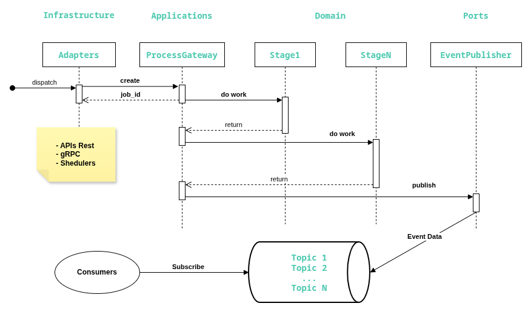
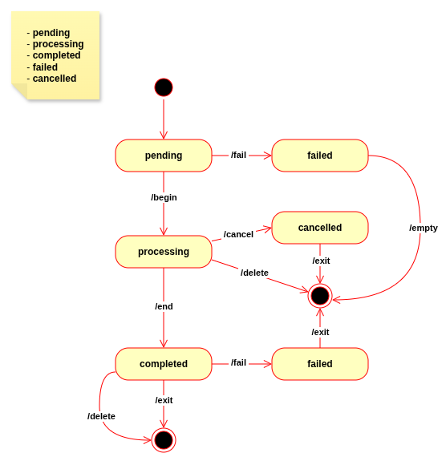
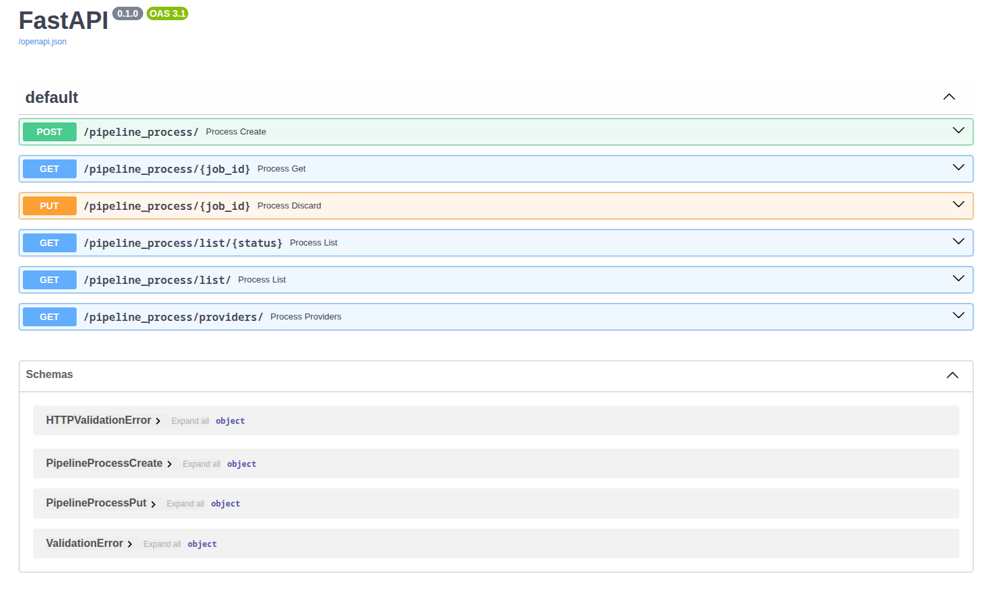
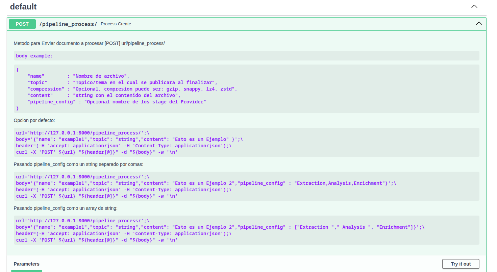
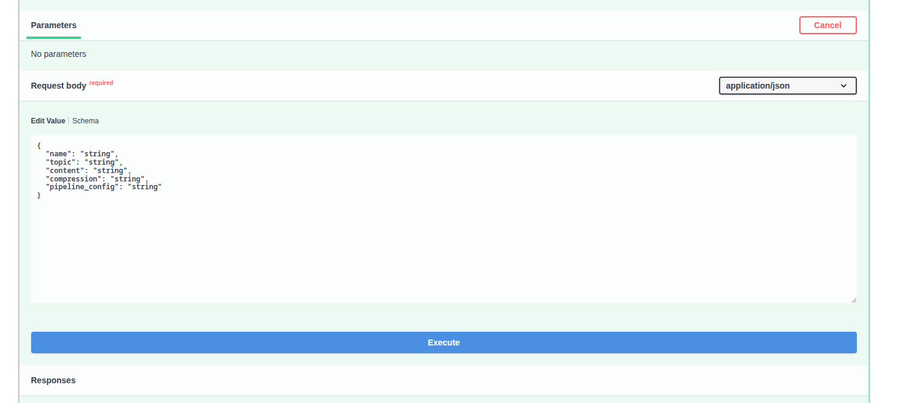
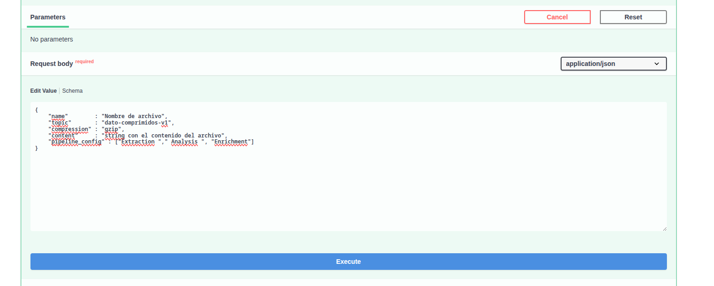
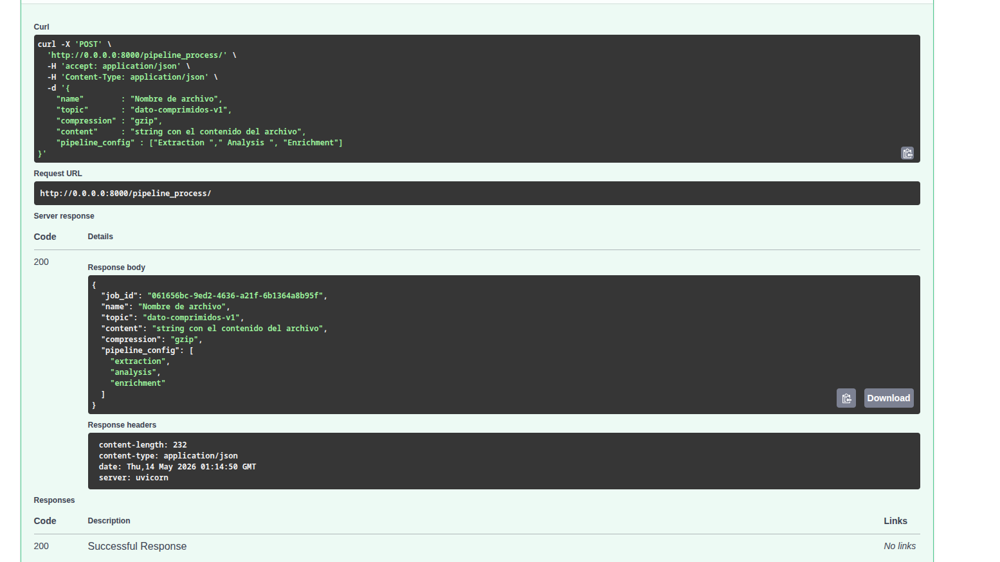

# Document Processing
Aplicación de **Microservicio** y Arquitectura Hexagonal para **Pipeline** de Procesamiento de documentos.

**Contenido**:

  - [**Document Processing Gateway**](#document-processing-gateway)
  - [**Preparación del entorno**](#preparación-del-entorno)
  - [**Despliegue con docker compose**](#despliegue-con-docker-compose)
  - [**Swagger Docs**](#swagger-docs)
  - [**unittest**](#unittest)
  - [**Resumen de Pasos para el Despliegue**](#resumen-de-pasos-para-el-despliegue)
  - [**APIs Rest**](#apis-rest)
  - [**gRPC**](#grpc)
  
  - [**Abreviaturas**](#abreviaturas)
  - [**static code analyzers with pylint**](#static-code-analyzers-with-pylint)
  - [**Autor**](#autor)
  
# Document Processing Gateway

<details>
  <summary><b>Estructura de la aplicación:</b></summary>

```bash
app
├── application
│   ├── __init__.py
│   ├── providermocks.py # Mock/Simulación de Proveedores externos
│   └── services.py      # Casos de uso que implementan los puertos y worker
│
├── domain     # Entidades con reglas de negocio
│   ├── __init__.py
│   ├── ports.py       # Interfaces abstractas p/repositorios o eventos
│   └── worker.py      # Base Class/Interfaces abstractas p/el modelar la Lógica de negocio
│
├── infrastructure # Adaptadores (entrada y salida)
│   ├── adapters
│   │   ├── __init__.py
│   │   ├── adapters.py      # modelo que implementa la interfaces de worker
│   │   ├── settings.py      # Configuraciones para el adapter redis/celery/kafka
│   │   ├── tasks_celery.py  # Implementación concreta de los puertos
│   │   └── worker_redis.py  # Implementacion concreta p/modelar de Lógica de negocio
│   │
│   ├── apis          # Adaptador HTTP (FastAPI/Flask)
│   │   ├── __init__.py
│   │   └── fastapi.py 
│   │
│   ├── grpc          # Adaptador gRPC
│   │   ├── __init__.py
│   │   ├── settings.py     # Configuraciones para el adapter gRPC
│   │   ├── grpc_utils.py   
│   │   ├── server.py       # services gRPC
│   │   ├── client.py       # Aplicacion para el manejo del client
│   │   ├── protobuf        # modulos autogenerados para protobuf
│   │   │   ├── __init__.py
│   │   │   ├── pipeline_process_pb2_grpc.py
│   │   │   ├── pipeline_process_pb2.py
│   │   │   └── pipeline_process_pb2.pyi
│   │   │   
│   │   └── protos          # configuracion para protobuf
│   │       └── pipeline_process.proto
│   │
│   └── __init__.py
│
└── __init__.py

```

</details>
<br>

  - **domain** (Dominio): Contiene entidades con reglas de negocio puras, excepciones y interfaces abstractas (**ports**) para repositorios o eventos. 
  
  - **application** (Aplicación): Orquesta casos de uso, validaciones de entrada y servicios que implementan las interfaces definidas en el **domain** (dominio). 
  
  - **infrastructure** (Infraestructura): Implementa los **adapters** (entrada y salida) que conectan con el mundo exterior, como bases de datos, APIs REST o colas de mensajes. 
  
  - **tests** (Pruebas unitarias): Verifica la lógica del **domain** y la correcta integración de los **adapters**. 
  
## Contexto
**Microservicio** para la orquestación del procesamiento de documentos a través de un ++ de proveedores externos. Se recibe **JSON** con la información (como la **metadata** del archivo) y ++ del documentos (`"content"` como un string), dicha información es procesada por distintos **stages** de procesamiento (extracción, análisis y enriquecimiento), y al finalizar la misma es publicada en un servicios **Event Streaming** para que sea luego consumida por servicio de **downstream** de eventos.


## Arquitectura General

<details>
  <summary><b>Diagrama General</b></summary>

```
  [API Rest, gRPC]                   [Celery/Redis]             [Providers]
                                 +------------------+
 Peticion de procesamiento -->   |                  |
                                 |    Document      | <----> Proveedor de Extracción (mock)
 Status de un Job          -->   |    Processing    | 
 Cancel/Delete Job         -->   |    Gateway       | <----> Proveedor de Análisis (mock)
                                 |                  | 
 Listado de Jobs           -->   |                  | <----> Proveedor de Enriquecimiento (mock)
                                 +--------+---------+
                                          |
                                          |
                                         \ /
                                          .
                                  Event Streaming               [Apache Kafka]
                               (eventos del pipeline)                    
                                          |
                                          |
                                         \ /
                                          .
                                   Consumer(s)
                                (servicios downstream)
```

</details>
<br>

Desde el punto de vista de las APIs (Entrada) tenemos :

| Accion                      | **API REST**                            | **gRPC**                   |
|:----------------------------|:----------------------------------------|:---------------------------|
| **Enviar documento a procesar** | `[POST] pipeline_process/`                               | `create() CreateRequest(body)`         |
| **Consultar estado de un Job**  | `[GET]  pipeline_process/<job_id>`                       | `get()    job_id=<VAL:str>`            |
| **Cancelar o Eliminar un Job**  | `[PUT]  pipeline_process/<job_id> {"status":"cancelled"}`| `put()    job_id=<VAL:str>,status=<VAL:str>`|
|                                 | `[PUT]  pipeline_process/<job_id> {"status":"deleted"}`  |                                        |
| **Listar Jobs**                 | `[GET]  pipeline_process/list/[<status>]`                | `list_jobs()`                          | 
|                                 |                                                          | `list_jobs() status=<VAL:str>`         | 
| **Listado de Proveedores**      | `[GET]  pipeline_process/providers/`                     | `list_providers()`                     |
  

  

  
Para las diferentes **APIs** y **services** el código del response se verifica mediante 
 - `code: 0` : succes
 - `code: 1` : error en los campos de la petición, se especifica un campo `"message"` con la descripción del error.
 
## Diagrama General del Flujo de datos


<br>

## Manejo de la FSM de Workers

<div style="display: grid; grid-template-columns: 1fr 1fr;">
<div style="text-align: center;">


    
</div>
<div style="text-align: left; font-size: 13px">
<br>

***Estados***

  - **PENDING** : estado inicial de cualquier worker
  - **PROCESSING** : estado de un worker que esta siendo ejecutado.
  - **COMPLETED** : worker que ya finalizo.
  - **FAILED** : estado para el worker que fallo.
  - **CANCELLED** : estado que se solicito cancelar. 

<br>

***Actions***

   - **`/fail`** : loguea el fallo y marca el worker id con el estado **FAILED**.
   - **`/empty`**: sale de la tarea sin almacenar contexto.
   
   - **`/begin`**: marca el worker id con el estado **PROCESSING** e invoca el método **`begin()`** (quien inicia el contexto   de ejecución). 
   
   - **`/cancel`**: marca el worker id con el estado **CANCELLED** e invoca el método **`cancel()`** (quien actualiza el   contexto de ejecucion).
   
   - **`/end`**: marca el worker id con el estado **COMPLETED** e invoca el método **`end()`** (quien actualiza el contexto de   ejecución).
   
   - **`/exit`**: arma el response para que el **scheduler** lo disponga a las próximas consultas de estados.
   
   - **`/delete`**: Elimina el worker id y el contexto relacionado al **job_id** del task.

</div>
</div>
<br>


# Preparación del entorno
## Dependencias
La principal dependencia es la instalación de [**docker**](https://docs.docker.com/engine/install/) en la versión V2, la cual incluye el sub-comando `compose`. Instalada esta podemos ejecutar los comandos para el despliegue independientemente del sistema operativo.

Para el caso de usar distribuciones de **linux** como **Fedora** o **RedHat** debemos habilitar los permisos de acceso al directorio principal del proyecto. Ya que este se montara como un volumen a los diferentes contenedores. 

```bash
curr=${PWD};cd .. && chcon -R -t svirt_sandbox_file_t "${curr}/" && cd -
```
  > ***Con cada cambio en la estructura de directorios dentro de la aplicación, debemos ejecutar el mismo para que los contenedores tengan accesos a dichos cambios. De lo contrario tendremos un error similar a este `The file/folder XXXX doesn't exist!`***

## Creación de los .env Kafka
Debemos crear el archivo **`deploy/kafka/environment/.env`** con la siguiente configuración:

```bash
KAFKA_NODE_ID=1
KAFKA_PROCESS_ROLES='broker,controller'
KAFKA_LISTENERS='PLAINTEXT://:9092,CONTROLLER://:9093'
KAFKA_CONTROLLER_LISTENER_NAMES='CONTROLLER'
KAFKA_CONTROLLER_QUORUM_VOTERS='1@kafka:9093'
KAFKA_OFFSETS_TOPIC_REPLICATION_FACTOR=1
KAFKA_TRANSACTION_STATE_LOG_REPLICATION_FACTOR=1
KAFKA_TRANSACTION_STATE_LOG_MIN_ISR=1
KAFKA_GROUP_INITIAL_REBALANCE_DELAY_MS=0
KAFKA_NUM_PARTITIONS=3
KAFKA_ADVERTISED_LISTENERS='PLAINTEXT://kafka:9092'
KAFKA_LISTENER_SECURITY_PROTOCOL_MAP='PLAINTEXT:PLAINTEXT,CONTROLLER:PLAINTEXT'
KAFKA_INTER_BROKER_LISTENER_NAME='PLAINTEXT'
CLUSTER_ID='MkU3OEVBNTcwNTJENDM2Qk'
```
  > Para este caso `CLUSTER_ID` es opcional, se utiliza en caso que escalemos. En tal caso se deberán generar varios `CLUSTER_ID` uno por cada services (al igual que las Variables). Para generar el valor de esta solo debemos ejecutar en una terminal `uuidgen --time | tr -d '-' | base64 | cut -b 1-22`.


## Creación de los .env del proyecto
Para este caso debemos generar el archivo **`.env`** (dentro del **root** del proyecto) con la siguiente secuencia:

```bash
# enviroment con las claves
REDISCLI_AUTH='ContraseniaSegura'
REDIS_URL='redis'
REDIS_PORT=6379
REDIS_DB=0
MOCKING_PROVIDER=true
KAFKA_URL='kafka'
KAFKA_PORT=9092
GRPC_URL='grpc'
GRPC_PORT=50051
GRPC_POLL_TRHEAD=10
```
  
# Despliegue con docker compose
## Verificación
Paso previo debemos verificar la configuración del archivo **`docker-compose.yml`**, esto nos servirá para verificar si los **`.env`** fueron creados de forma satisfactoria.

```bash
docker compose config
```
<br>
<details>
  <summary><b> Configuración Docker-Compose </b></summary>

```bash
name: documentprocessing
services:
  celery:
    build:
      context: /path-repo/0P-Python/DocumentProcessing/deploy
      dockerfile: ./celery/Dockerfile
    command:
      - celery
      - -A
      - app.infrastructure.adapters.tasks_celery
      - worker
      - --loglevel=info
      - --concurrency=4
    container_name: Celery
    depends_on:
      redis:
        condition: service_healthy
        required: true
    environment:
      TZ: America/Argentina/Buenos_Aires
    healthcheck:
      test:
        - CMD-SHELL
        - celery -A app.infrastructure.adapters.tasks_celery inspect ping --destination celery@$$HOSTNAME
      timeout: 10s
      interval: 30s
      retries: 3
      start_period: 5s
    networks:
      default: null
    volumes:
      - type: bind
        source: /path-repo/0P-Python/DocumentProcessing
        target: /application
        bind: {}
  fastapi:
    build:
      context: /path-repo/0P-Python/DocumentProcessing/deploy
      dockerfile: ./fastapi/Dockerfile
    command:
      - uvicorn
      - app.infrastructure.apis.fastapi:fastapi
      - --host
      - 0.0.0.0
      - --port
      - "8000"
    container_name: FastApi
    depends_on:
      celery:
        condition: service_healthy
        required: true
      redis:
        condition: service_healthy
        required: true
    environment:
      TZ: America/Argentina/Buenos_Aires
    networks:
      default: null
    ports:
      - mode: ingress
        target: 8000
        published: "8000"
        protocol: tcp
    volumes:
      - type: bind
        source: /path-repo/0P-Python/DocumentProcessing
        target: /application
        bind: {}
  grpc:
    build:
      context: /path-repo/0P-Python/DocumentProcessing/deploy
      dockerfile: ./grpc/Dockerfile
    command:
      - python3
      - app/infrastructure/grpc/server.py
      - --port
      - "50051"
      - --pool_thread
      - "10"
    container_name: gRPC
    depends_on:
      celery:
        condition: service_healthy
        required: true
      redis:
        condition: service_healthy
        required: true
    environment:
      TZ: America/Argentina/Buenos_Aires
    networks:
      default: null
    ports:
      - mode: ingress
        target: 50051
        published: "50051"
        protocol: tcp
    volumes:
      - type: bind
        source: /path-repo/0P-Python/DocumentProcessing
        target: /application
        bind: {}
  kafka:
    container_name: Kafka
    environment:
      CLUSTER_ID: MkU3OEVBNTcwNTJENDM2Qk
      KAFKA_ADVERTISED_LISTENERS: PLAINTEXT://kafka:9092
      KAFKA_CONTROLLER_LISTENER_NAMES: CONTROLLER
      KAFKA_CONTROLLER_QUORUM_VOTERS: 1@kafka:9093
      KAFKA_GROUP_INITIAL_REBALANCE_DELAY_MS: "0"
      KAFKA_INTER_BROKER_LISTENER_NAME: PLAINTEXT
      KAFKA_LISTENER_SECURITY_PROTOCOL_MAP: PLAINTEXT:PLAINTEXT,CONTROLLER:PLAINTEXT
      KAFKA_LISTENERS: PLAINTEXT://:9092,CONTROLLER://:9093
      KAFKA_NODE_ID: "1"
      KAFKA_NUM_PARTITIONS: "3"
      KAFKA_OFFSETS_TOPIC_REPLICATION_FACTOR: "1"
      KAFKA_PROCESS_ROLES: broker,controller
      KAFKA_TRANSACTION_STATE_LOG_MIN_ISR: "1"
      KAFKA_TRANSACTION_STATE_LOG_REPLICATION_FACTOR: "1"
      TZ: America/Argentina/Buenos_Aires
    image: apache/kafka:latest
    networks:
      default: null
    ports:
      - mode: ingress
        target: 9092
        published: "9092"
        protocol: tcp
      - mode: ingress
        target: 9093
        published: "9093"
        protocol: tcp
    volumes:
      - type: volume
        source: kafka-data
        target: /var/lib/kafka/data
        volume: {}
  redis:
    command:
      - redis-server
      - --requirepass
      - Alfa12345Joj4
      - --appendonly
      - "yes"
    container_name: Redis
    environment:
      TZ: America/Argentina/Buenos_Aires
    healthcheck:
      test:
        - CMD
        - redis-cli
        - ping
      timeout: 5s
      interval: 10s
      retries: 5
    image: redis:8-alpine
    networks:
      default: null
    ports:
      - mode: ingress
        target: 6379
        published: "6379"
        protocol: tcp
    restart: unless-stopped
    volumes:
      - type: volume
        source: redis-data
        target: /data
        volume: {}
  tests:
    build:
      context: /path-repo/0P-Python/DocumentProcessing/deploy
      dockerfile: ./tests/Dockerfile
    container_name: Tests
    environment:
      TZ: America/Argentina/Buenos_Aires
    networks:
      default: null
    volumes:
      - type: bind
        source: /path-repo/0P-Python/DocumentProcessing
        target: /application
        bind: {}
networks:
  default:
    name: documentprocessing_default
volumes:
  kafka-data:
    name: documentprocessing_kafka-data
  redis-data:
    name: documentprocessing_redis-data

```
    
</details>

## Creación
```bash
# build and start containers
docker compose up --build -d 


# Create and start containers
## -d: Detached mode: Run containers in the background
docker compose up -d

# --build            Build images before starting containers
# --remove-orphans   Remove containers for services not defined in the Compose file
```

## Stop/Start/restart
```bash
# Stop services
docker compose stop

# Start services
docker compose start

# Restart service containers
docker compose restart
```

## Status
```bash
# List containers
docker compose ps

# Display the running processes
docker compose top

# Display a live stream of container(s) resource usage statistics
docker compose stats

# List running compose projects
docker compose ls
```

## Delete
```bash
# Stop and remove containers, networks
## -v Remove named volumes declared in the "volumes" section and anonymous volumes attached to containers
docker compose down -v
```

## Logs
```bash
# View output from containers
docker compose logs -f
docker compose logs -tf
```
Para una mejor comodidad podemos adjuntar (**attached terminal**) una terminal a un log de un services en particular:

```bash
docker compose logs -f kafka 
docker compose logs -f redis 
docker compose logs -f celery 
docker compose logs -f grpc
```

## Conexión a una terminal dentro del contenedor
```bash
docker exec -it Kafka '/bin/bash'
docker exec -it Redis '/bin/bash'
docker exec -it Celery '/bin/bash'
docker exec -it gRPC '/bin/bash'
```

# Swagger Docs
Aprovechando la ventaja de la generación de documentación automática de `FastAPIs` con los servicios iniciados podemos acceder a ella, para visualizar y ejecutar peticiones desde la web. Sin necesidad de ejecutar comandos que involucren `curl` o ejecutar script con finalidades similares.

Dentro de nuestro ambiente en el cual desplegamos debemos acceder a la pagina [**`http://127.0.0.1:8000/docs`**](http://127.0.0.1:8000/docs):



Expandimos la documentación para `[POST] url/pipeline_process/`:


Al final de este detalle del lado derecho tendremos el botón **`Try it out`**, el cual habilita la prueba del **endpoint** desde **`Swagger UI`**, aqui un ejemplo para el test del **endpoint** en cuestión:



Armamos el body en función de los datos requeridos:



``` json
{
    "name"        : "Nombre de archivo",
    "topic"       : "dato-comprimidos-v1",
    "compression" : "gzip",
    "content"     : "string con el contenido del archivo",
    "pipeline_config" : ["Extraction "," Analysis ", "Enrichment"]
}
```

Luego de ejecutar se visualizara la respuesta desde el servicio:




# unittest
## Para el test completo 
```bash
services='tests'; \
flags="--name Unittest --rm -u $(id -u $USER):20 -e TZ=America/Argentina/Buenos_Aires"; \
docker compose run ${flags} ${services} bash -c "python3 -m unittest -v"
```


## Test Especifico
```bash
services='tests'; \
flags="--name Unittest --rm -u $(id -u $USER):20 -e TZ=America/Argentina/Buenos_Aires"; \
module="tests.test_process_gateway.Test_ProcessGatewayV1.test_create"; \
docker compose run ${flags} ${services} bash -c "python3 -m unittest -v ${module}" 
```

## Consumo de los job creados por los unittest
```bash
services='tests'; \
flags="--name KafkaClient --rm -u $(id -u $USER):20 -e TZ=America/Argentina/Buenos_Aires"; \
docker compose run ${flags} ${services} bash -c "python3 tests/kafka-servicios-downstream.py"
```

Para mas detalles contamos con el help del script :

```bash
usage: kafka-servicios-downstream.py [-h] [-t TOPIC [TOPIC ...]]

Kafka Apache Consumer

options:
  -h, --help            show this help message and exit
  -t, --topic TOPIC [TOPIC ...]
                        topic names.
```
  > El topic/tema por defecto al cual se subscribe es **`dato-comprimidos-v1`**.

```bash
services='tests'; \
flags="--name KafkaClient --rm -u $(id -u $USER):20 -e TZ=America/Argentina/Buenos_Aires"; \
docker compose run ${flags} ${services} bash -c "python3 tests/kafka-servicios-downstream.py -t my-topic"
```
  

<details>
  <summary><b>Mensaje JSON Publicado en service downstream</b></summary>

Para los Provider establecidos deberíamos ver mensajes JSON del siguiente Tipo:

``` json
{
    "name": "Test_ProcessGatewayV1-idx08",
    "topic": "dato-comprimidos-v1",
    "content": "Datos Originales-id 08",
    "Extraction": {
        "name": "ProviderExtraction",
        "data": {
            "name": "Test_ProcessGatewayV1-idx08",
            "topic": "dato-comprimidos-v1",
            "content": "Datos Originales-id 08"
        }
    },
    "Analysis": {
        "name": "ProviderAnalysis",
        "data": {
            "name": "Test_ProcessGatewayV1-idx08",
            "topic": "dato-comprimidos-v1",
            "content": "Datos Originales-id 08",
            "Extraction": {
                "name": "ProviderExtraction",
                "data": {
                    "name": "Test_ProcessGatewayV1-idx08",
                    "topic": "dato-comprimidos-v1",
                    "content": "Datos Originales-id 08"
                }
            }
        }
    },
    "Enrichment": {
        "name": "ProviderEnrichment",
        "data": {
            "name": "Test_ProcessGatewayV1-idx08",
            "topic": "dato-comprimidos-v1",
            "content": "Datos Originales-id 08",
            "Extraction": {
                "name": "ProviderExtraction",
                "data": {
                    "name": "Test_ProcessGatewayV1-idx08",
                    "topic": "dato-comprimidos-v1",
                    "content": "Datos Originales-id 08"
                }
            },
            "Analysis": {
                "name": "ProviderAnalysis",
                "data": {
                    "name": "Test_ProcessGatewayV1-idx08",
                    "topic": "dato-comprimidos-v1",
                    "content": "Datos Originales-id 08",
                    "Extraction": {
                        "name": "ProviderExtraction",
                        "data": {
                            "name": "Test_ProcessGatewayV1-idx08",
                            "topic": "dato-comprimidos-v1",
                            "content": "Datos Originales-id 08"
                        }
                    }
                }
            }
        }
    }
}
```
 
</details>
<br>

# Resumen de Pasos para el Despliegue
1. build and up
```bash
docker compose up -d
```

2. Verificamos que todos los **services** este Creados y Up
```bash
docker compose ps
```
> Debemos considerar que el **Services** tests o Contenedor Tests no debe quedar en estado Up, ya que el mismo solo se preparo para realizar los test unitarios e incluye todas las librerías necesarias (combinación de todos los servicios)

3. Verificamos los logs
```bash
docker compose logs -f
```

Podemos recorrer uno por uno para verificar que no existen errores de despliegue

```bash
docker compose logs -f celery
docker compose logs -f fastapi
docker compose logs -f kafka
docker compose logs -f redis
```

4. Ingresamos a la pagina [**FastAPI Swagger UI**](#swagger-docs) [**`http://0.0.0.0:8000/docs`**](http://127.0.0.1:8000/docs), de la cual podemos lanzar una petición desde `[POST] url/pipeline_process/`:

``` json
{
    "name"        : "Nombre de archivo",
    "topic"       : "dato-comprimidos-v1",
    "compression" : "gzip",
    "content"     : "string con el contenido del archivo",
    "pipeline_config" : ["Extraction ","Enrichment"]
}
```

Para consumir el **downstream**, podemos ejecutar:

```bash
services='celery'; \
flags="--name KafkaClient --rm -u $(id -u $USER):20 -e TZ=America/Argentina/Buenos_Aires"; \
docker compose run ${flags} ${services} bash -c "python3 tests/kafka-servicios-downstream.py"
```


5. Ejecución de los unittest
```bash
services='tests'; \
flags="--name Unittest --rm -u $(id -u $USER):20 -e TZ=America/Argentina/Buenos_Aires"; \
docker compose run ${flags} ${services} bash -c "python3 -m unittest -v"
```

# Apis Rest
## Obtener el listado de Proveedores
Para esta acción contamos con endpoint **`[GET] url/pipeline_process/providers/`**, el cual podemos consultar de la siguiente manera:

``` bash
url="http://127.0.0.1:8000/pipeline_process/providers/" ;\
curl -sS "${url}" -i -X GET -w '\n'

HTTP/1.1 200 OK
date: Sat, 16 May 2026 18:14:54 GMT
server: uvicorn
content-length: 61
content-type: application/json

{"code":0,"providers":["extraction","analysis","enrichment"]}
```
El response deberá ser del siguiente tipo:

``` json
{
  "code": 0 ,
  "providers": [
    "extraction",
    "analysis",
    "enrichment"
  ]
}
```

## Petición de procesamiento
Para la petición (**`[POST] pipeline_process/`**) de la creación de un **Job** tenemos el siguiente **Body**:

``` json
{
    "name"        : "Nombre de archivo",
    "topic"       : "Tópico/tema en el cual se publicara al finalizar",
    "compression" : "Opcional, compresión puede ser: gzip, snappy, lz4, zstd",
    "content"     : "string con el contenido del archivo",
    "pipeline_config" : "Opcional nombre de los stage del Provider que se ejecutaran"
}
```
  > **`"topic"`** : Este campo representa el TOPIC con el cual se publicaran los resultados, es importante ya que el consumidor del **servicios downstream** debera usar este para acceder al resultado.

  > **"pipeline_config"** Para el caso particular de este campo, esté puede ser una cadena de string con cada proveedor separado por comas (con o sin espacio entre ellos). O un array con los mismo. Se respeta el orden y si se repite un stage el mismo se repetirá en la ejecución y orden.
  Para obtener el listado actual de proveedores disponibles contamos con el endpoint **`[GET] url/pipeline_process/providers/`**.

Y el response deberá tener la siguiente Forma:

``` json
{
    "job_id"      : "ID del JOB creado",
    "name"        : " ... ",
    "topic"       : " ... ",
    "compression" : " ... ",
    "content"     : " ... ",
    "pipeline_config" : "..."
}
```
  > En caso de error tendremos los tabulados para **API Rest** relacionados al servicio.
  > Debemos considerar que los errores relacionados a la sintaxis de un campo en particular no se capturan, ya que es un sistema asincronía y estos son validados para cada etapa y capa en particular. Los mismos se reflejaran en los llamados posteriores para obtener el estado en función del **ID** generado.

Como podemos Observar la respuesta contiene request mas el campo `"job_id"`, él cual se deberá utilizar para realizar cualquier acción sobre el Job creado.

Ejemplos para el lanzamiento de un nuevo **Job**:

1. Opción por defecto:

``` bash
url='http://127.0.0.1:8000/pipeline_process/';\
body='{"name": "example1","topic": "dato-comprimidos-v1","content": "Esto es un Ejemplo" }';\
header=(-H 'accept: application/json' -H 'Content-Type: application/json');\
curl -X 'POST' ${url} "${header[@]}" -d "${body}" -w '\n'

{"job_id":"ab357e70-3570-4c3f-90e5-fe03f35c1a44","name":"example1","topic":"string","compression":null,"pipeline_config":["extraction"]}
```

2. Pasando `pipeline_config` como un string separado por comas:

```bash
url='http://127.0.0.1:8000/pipeline_process/';\
body='{"name": "example1","topic": "dato-comprimidos-v1","content": "Esto es un Ejemplo 2","pipeline_config" : "Extraction,Analysis,Enrichment"}';\
header=(-H 'accept: application/json' -H 'Content-Type: application/json');\
curl -X 'POST' ${url} "${header[@]}" -d "${body}" -w '\n'

{"job_id":"58a68aaf-4cb7-4b5c-bd1d-02a2056a8fb7","name":"example1","topic":"string","compression":null,"pipeline_config":["extraction","analysis","enrichment"]}
```

3. Pasando `pipeline_config` como un array de string:

```bash
url='http://127.0.0.1:8000/pipeline_process/';\
body='{"name": "example1","topic": "dato-comprimidos-v1","content": "Esto es un Ejemplo 2","pipeline_config" : ["Extraction "," Analysis ", "Enrichment"]}';\
header=(-H 'accept: application/json' -H 'Content-Type: application/json');\
curl -X 'POST' ${url} "${header[@]}" -d "${body}" -w '\n'

{"job_id":"33c48064-bc4b-4a65-ae08-635be0bb616e","name":"example1","topic":"string","compression":null,"pipeline_config":["extraction","analysis","enrichment"]}
```


## Status de un Job
Consultar estado de un **Job** mediante su **ID**, `[GET]  pipeline_process/<job_id>`

1. Obtener estado de un **Job**, con información detallada del servicio 
```bash
job_id="XXXXXXXX";\
uri="http://127.0.0.1:8000/pipeline_process/${job_id}" ;\
curl -sS "${uri}" -i -X GET -w '\n'
HTTP/1.1 200 OK
date: Sat, 16 May 2026 18:21:36 GMT
server: uvicorn
content-length: 219
content-type: application/json

{"code":0,"job_id":"XXXXXXXX","name":"example1","topic":"string","stages":"completed","pipeline":"extraction, analysis, enrichment","job_status":"completed","ready":true,"status":"completed"}
```

2. Obtener estado de un **Job**, solo información del **Job**
```bash
job_id="XXXXXXXX";\
uri="http://127.0.0.1:8000/pipeline_process/${job_id}" ;\
curl -sS "${uri}" -X GET -w '\n'

{"code":0,"job_id":"XXXXXXXX","name":"example1","topic":"string","stages":"completed","pipeline":"extraction, analysis, enrichment","job_status":"completed","ready":true,"status":"completed"}
```

3. Response
``` json
{
  "code": 0,
  "job_id": "XXXXXXXX",
  "name": "example1",
  "topic":"string",
  "stages":"completed",
  "pipeline":"extraction, analysis, enrichment",
  "job_status":"completed",
  "ready":true,
  "status":"completed"
}
```

## Cancel Eliminar un Job
Cancelar o Eliminar un job, **`[PUT] pipeline_process/<job_id> {"status": "'cancelled|deleted'"}`**. Podemos eliminar el mismo en cualquier ciclo de vida. Debemos considerar que la eliminación se realiza en dos etapas, primero se cancela el **Job** (si el mismo esta siendo ejecutado) y luego se elimina del sistema persistente. 

> Nota el sistema persistente solo mantiene la mínima información posible sobre un Job. Esta no preserva información relacionada al archivo, solo los estados y demás data relacionada al procesamiento (**pipeline**, **stage**, **status**). Dichos datos son encapsulados en un mecanismo de contexto el cual tiene una vida limitada en cuanto a persistencia (hasta 7 días, según configuración).


1. Cancelación de **Job**

```bash
job_id="XXXXXXXX";\
url="http://127.0.0.1:8000/pipeline_process/${job_id}";\
header=(-H 'accept: application/json' -H 'Content-Type: application/json');\
body='{"status": "cancelled"}';\
curl -X 'PUT' "${url}" "${header[@]}" -d "${body}" -w '\n'
```

2. Delete **Job**

```bash 
job_id="XXXXXXXX";\
url="http://127.0.0.1:8000/pipeline_process/${job_id}";\
header=(-H 'accept: application/json' -H 'Content-Type: application/json');\
body='{"status": "deleted"}';\
curl -X 'PUT' "${url}" "${header[@]}" -d "${body}" -w '\n'
```

3. Response de un **Job** Completado
``` json
{
  "code": 0,
  "job_status": "completed",
  "message": "No se puede cancelar el worker id '061656bc-9ed2-4636-a21f-6b1364a8b95f', fue completado",
  "job_id": "061656bc-9ed2-4636-a21f-6b1364a8b95f"
}
```
## Listado de Jobs
Retorna el listado de Job que se encuentran en un estado en particular. **`[GET] pipeline_process/list/[<status>]`**. En caso de no aportar el **`<status>`** retornara el listado para cada uno de los estados.

Los estados posibles en los que puede estar el **Proccess**

- **`pending`**
- **`processing`**
- **`completed`**
- **`failed`**
- **`cancelled`**

1. Get, **`status=cancelled`**

```bash
status="cancelled" ;\
url="http://127.0.0.1:8000/pipeline_process/list/${status}" ;\
curl -sS "${url}" -i -X GET -w '\n'
HTTP/1.1 200 OK
date: Sat, 16 May 2026 18:24:57 GMT
server: uvicorn
content-length: 25
content-type: application/json

{"code":0,"cancelled":[]}
```

2. Get default, el listado de todos los estados

```bash
url="http://127.0.0.1:8000/pipeline_process/list/";\
curl -sS "${url}" -i -X GET -w '\n'
HTTP/1.1 200 OK
date: Sat, 16 May 2026 18:25:22 GMT
server: uvicorn
content-length: 305
content-type: application/json

{"pending":[],"processing":[],"completed":["4f97cc4e-337f-4b4e-9c16-2a44b6de05a0","3d435558-215a-4e67-93bf-641da1e185ef","a33af399-7407-4e12-b293-2d40fb603c26","ab357e70-3570-4c3f-90e5-fe03f35c1a44","58a68aaf-4cb7-4b5c-bd1d-02a2056a8fb7","33c48064-bc4b-4a65-ae08-635be0bb616e"],"failed":[],"cancelled":[]}
```


<br>
<details>
  <summary><b>Response para el Status Processing:</b></summary>

``` json
{
  "processing": [
    "98a18e95-3c2b-4c7a-b22e-65061f468214"
  ]
}
```

</details>
<details>
  <summary><b>Response sin status</b></summary>

``` json
{
  "pending":[],
  "processing":[],
  "completed":[
    "4f97cc4e-337f-4b4e-9c16-2a44b6de05a0",
    "3d435558-215a-4e67-93bf-641da1e185ef",
    "a33af399-7407-4e12-b293-2d40fb603c26",
    "ab357e70-3570-4c3f-90e5-fe03f35c1a44",
    "58a68aaf-4cb7-4b5c-bd1d-02a2056a8fb7",
    "33c48064-bc4b-4a65-ae08-635be0bb616e"
  ],
  "failed":[],
  "cancelled":[]
}
```

</details>
<br>


# gRPC 
Para el test de este servicio contamos con `app/infrastructure/grpc/client.py` el cual contiene una lógica mínima para lanzar pruebas y verificar el funcionamiento. Se mantiene la misma estructura de las APIs Rest

  - **`create()`**: para crear un nuevo job
  - **`get()`** : para obtener el estado actual de un job
  - **`put()`** : para cancelar o eliminar un job
  - **`list_jobs()`** : para listar todos los job por estado o solo los job en un estado particular.
  - **`list_providers()`** : para listar los Provider externos. 

Para poder lanzar las diferentes pruebas podemos atacharnos mediante una terminal al contenedor **`gRPC`**. El cual ya posee el contexto para poder realizar las acciones. Para realizar esto solo debemos ejecutar el comando:

```bash 
docker exec -it gRPC '/bin/bash'
```

## create
```bash
python3 app/infrastructure/grpc/client.py --create '{"name": "Archivo de test por gRPC","topic": "dato-comprimidos-v1","content": "string con el contenido del archivo","compression": "gzip","pipeline_config" : " extraction , analysis, enrichment "}'

create Response:{
  "job_id": "5aa82099-3d2b-4744-922a-de69192afc23",
  "name": "Archivo de test por gRPC",
  "topic": "dato-comprimidos-v1",
  "compression": "gzip",
  "pipeline_config": " extraction , analysis, enrichment ",
  "code": 0
}
```

## get
```bash
python3 app/infrastructure/grpc/client.py --get '{"job_id" : "5aa82099-3d2b-4744-922a-de69192afc23"}'

get Response:{
  "job_id": "5aa82099-3d2b-4744-922a-de69192afc23",
  "name": "Archivo de test por gRPC",
  "topic": "dato-comprimidos-v1",
  "compression": "gzip",
  "stages": "completed",
  "pipeline": "extraction, analysis, enrichment",
  "job_status": "completed",
  "ready": true,
  "status": "completed",
  "code": 0
}
```

```bash
# job not found
python3 app/infrastructure/grpc/client.py --get '{"job_id" : "XYZPPDADFAFDEAEFAEFEAQV"}'

get Response:{
  "code": 1,
  "job_id": "XYZPPDADFAFDEAEFAEFEAQV",
  "message": "worker id 'XYZPPDADFAFDEAEFAEFEAQV' not found"
}
```

## put
```bash
python3 app/infrastructure/grpc/client.py --put '{"job_id" : "3d435558-215a-4e67-93bf-641da1e185ef", "status":"cancelled"}'

put Response:{
  "job_id": "3d435558-215a-4e67-93bf-641da1e185ef",
  "job_status": "completed",
  "message": "No se puede cancelar el worker id '3d435558-215a-4e67-93bf-641da1e185ef', fue completado",
  "code": 0
}
```

```bash
python3 app/infrastructure/grpc/client.py --put '{"job_id" : "3d435558-215a-4e67-93bf-641da1e185ef", "status":"deleted"}'

put Response:{
  "job_id": "3d435558-215a-4e67-93bf-641da1e185ef",
  "job_status": "completed",
  "message": "Se elimino del worker id '3d435558-215a-4e67-93bf-641da1e185ef'",
  "code": 0
}

# verificamos
python3 app/infrastructure/grpc/client.py --get '{"job_id" : "3d435558-215a-4e67-93bf-641da1e185ef"}'

get Response:{
  "code": 1,
  "job_id": "3d435558-215a-4e67-93bf-641da1e185ef",
  "message": "worker id '3d435558-215a-4e67-93bf-641da1e185ef' not found"
}
```

```bash
## peticion con error
python3 app/infrastructure/grpc/client.py --put '{"job_id" : "XYZPPDADFAFDEAEFAEFEAQV", "status":"canceled"}'

put Response:{
  "code": 1,
  "job_id": "XYZPPDADFAFDEAEFAEFEAQV",
  "status": "canceled",
  "message": "Estado 'canceled' no permitido, solo 'cancelled' o 'deleted'"
}
```

## list_jobs
```bash
## lista all jobs
python3 app/infrastructure/grpc/client.py --list_jobs

list_jobs Response:{
  "completed": [
    "17501cb2-03f8-4df5-9b10-ed7accef3d17",
    "4f97cc4e-337f-4b4e-9c16-2a44b6de05a0",
    "5aa82099-3d2b-4744-922a-de69192afc23",
    "ab357e70-3570-4c3f-90e5-fe03f35c1a44",
    "4e37b325-2ec3-4555-b5ff-285f1a784afc",
    "a33af399-7407-4e12-b293-2d40fb603c26",
    "58a68aaf-4cb7-4b5c-bd1d-02a2056a8fb7",
    "33c48064-bc4b-4a65-ae08-635be0bb616e"
  ],
  "code": 0,
  "pending": [],
  "processing": [],
  "failed": [],
  "cancelled": []
}
```

```bash
# Estados Posibles ['pending', 'processing', 'completed', 'failed', 'cancelled']
python3 app/infrastructure/grpc/client.py --list_jobs '{"status":"pending"}'
python3 app/infrastructure/grpc/client.py --list_jobs '{"status":"processing"}'
python3 app/infrastructure/grpc/client.py --list_jobs '{"status":"completed"}'
python3 app/infrastructure/grpc/client.py --list_jobs '{"status":"failed"}'
python3 app/infrastructure/grpc/client.py --list_jobs '{"status":"cancelled"}'

# con error en el campo status
python3 app/infrastructure/grpc/client.py --list_jobs '{"status":"canceled"}'
```
  > **Nota** : Como el en el cliente no tenemos lógica de verificación de los campos **repeated** para este service, siempre visualizaremos todos los campos, los que deberian estar ausente con el valor por defecto `[]`. 
  Esto lo realiza el cliente, no tiene sobrecarga el server, si monitoreamos el log del contenedor **gRPC/grpc** podemos observar la información que el servicio retorna en la solicitud, sin los campos sobrantes en función de la petición.


## list_providers
```bash
python3 app/infrastructure/grpc/client.py --list_providers

list_providers Response:{
  "providers": [
    "extraction",
    "analysis",
    "enrichment"
  ],
  "code": 0
}
```


# Abreviaturas
- **Job** : Abreviatura para representar el trabajo que realizara el '**Document Processing**'.


# static code analyzers with pylint
## Instalaccion
En caso de que necesitemos ejecutarlo fuera de un contenedor, podemos instalar el paquete necesario localmente.

```bash
python3 -m pip install pylint
```


## Ejecucion
### Usando el contendor de Tests
```bash
services='tests'; \
flags="--name Pylint --rm -u $(id -u $USER):20 -e TZ=America/Argentina/Buenos_Aires"; \
docker compose run ${flags} ${services} bash -c "pylint --rcfile ./pyproject.toml --recursive=y ."
```

### Desde el ambiente local
```bash
## modo recursivo
pylint --recursive=y .
```

Por cada modulo:

```bash
## Application
pylint ./app/application

## Domain
pylint ./app/domain

## Infrastructure
pylint ./app/infrastructure
```
<br>
<details>
  <summary><b>Por script/source file en particular:</b></summary>

```bash
pylint app.infrastructure.adapters.tasks_celery
pylint app.infrastructure.adapters.worker_redis
pylint app.infrastructure.adapters.settings
pylint app.infrastructure.adapters.adapters
pylint app.infrastructure.grpc.server
pylint app.infrastructure.grpc.grpc_utils
pylint app.infrastructure.grpc.settings
pylint app.infrastructure.grpc.client
pylint app.infrastructure.apis.fastapi
pylint app.domain.ports
pylint app.domain.worker
pylint app.application.providermocks
pylint app.application.services

```
 
</details>
<br>


# Autor
  + [Luccioni Jesuse Emanuel](mailto:jeluccioni@gmail.com)
  
