# Contenido
Una simple aplicacion web realizada con el framework [**DJango**](https://www.djangoproject.com/) para administrar ticket y orden de trabajo simples (sin prioridades).


+ [**Instalaccion de python en linux**](#instalaccion-de-python-en-linux)
+ [**Despliegue con virtual enviroment sobre linux**](#despliegue-con-virtual-enviroment-sobre-linux)

# Instalaccion de python en linux
Para la ejecución sin el uso de contenedor debemos tener instalada en el host los siguientes comandos:

  + **python3**
  + **pip3** (gestor de paquetes python)

## Instalación python linux
En dos pasos, primero updates para la verificacion e instalaccion de nuevas versiones de los packges instalados y luego instalaccion de los utilitarios.


### Distribuciones Debian y deribadas
``` bash
# distros debian
sudo apt update && sudo apt upgrade -y
sudo apt install -y python3 python3-pip
# o con apt-get
sudo apt-get install -y python3 python3-pip
```


### Distribuciones Fedora Red-Hat
``` bash
# distros fedora red-hat
sudo dnf update -y
sudo dnf install -y python3 python3-pip
```


# Despliegue con virtual enviroment sobre linux
Para esto contamos con el script [activate.sh](activate.sh), el cual solo depende de la instalacion de [python en el sistema](#instacion-python-linux). Este script realiza dos o solo una tarea dependiendo del contexto:

  1. Si el directorio del entorno virtual no existe crea el mismo e instala las dependencias sobre este.
  2. Habilita el entorno virtual y nos deja la terminal lista para [lanzar el proyecto](ejecucion-del-proyecto).

Para ejecutar el mismo solo debemos ejecutar el script de la siguente forma:

```bash
bash activate.sh
```
> Note: en caso de necesitar reinstalar el entorno virtual solo debemos ejecutar el comando **`bash activate.sh --clean`**, este eliminara el contexto actual para que luego pueda rearmar el mismo ejecutando **`bash activate.sh`**


1. Creacion de la Base de datos
```bash
bash activate.sh --migrate
```
2. Creacion de los static files
```bash
bash activate.sh --staticfiles
```

3. Creacion de usuario root
```bash
bash activate.sh --create-superuser
```
> **Lo necesitaremos para crear los usuarios administrador**.

4. Start de la aplicacion
```bash
# el puerto por defecto es el 8080
bash activate.sh --run

# Estableciendo el puerto
bash activate.sh --run 8000
```
Este ultimo paso deja tomada la terminal, por lo que si presionamos la combinacion de teclas `Ctrl + c`, finalizaremos la aplicacion. 


# Aplicacion
    + Superuser
    + Administrador
    + Cliente
    + Programador
    
## Start project
Para Inicar la aplicacion websolo debemos ejecutar los pasos: [**Despliegue con virtual enviroment sobre linux**](#despliegue-con-virtual-enviroment-sobre-linux). Para detener 

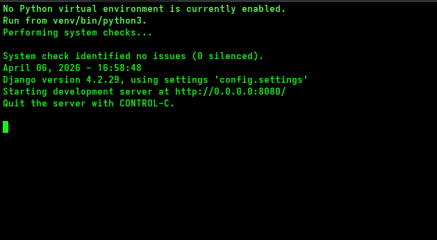
    
## Superuser
Usuario con permisos privilegiados, este pueder realizar todas las tareas de un administrador.Mas el alta de nuevos administradores.

1. Login 

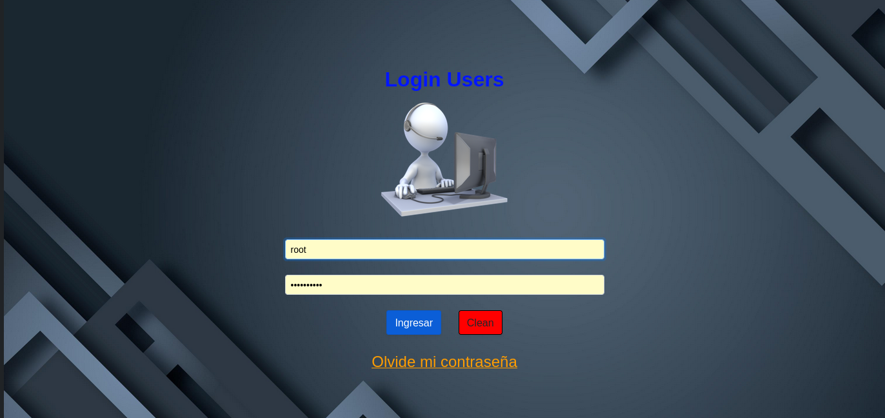

2. Home 

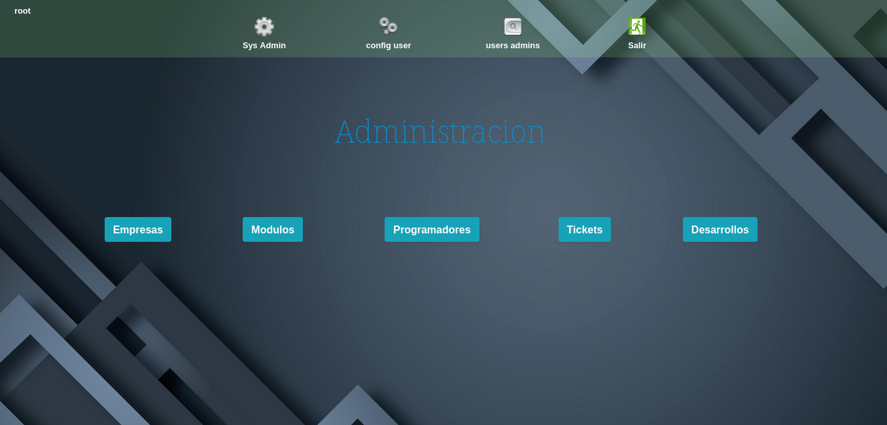

3. Lista, Alta, Modificacion y elmiinacion de Administradores 

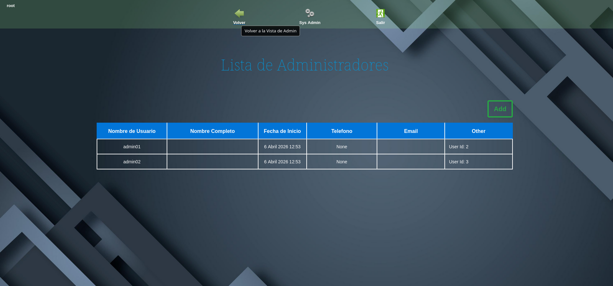


## Aministrador
Se encarga de realizar las acciones que se corresponde con administrar el trabajo para los programadores. Crear y asignar Orden de Trabajo (o tieckest) a los diferentes programadores.

Este tambien puede dar de alta :
  - Empresas y clientes para esta.
  - Nuevo Programadores
  - Nuevas Orden de trabajo

En cuanto a Ticket puede visualizar y editar (asignar quie lo debe atender) todos los dados de alta por cada cliente.

1. Home Aministrador 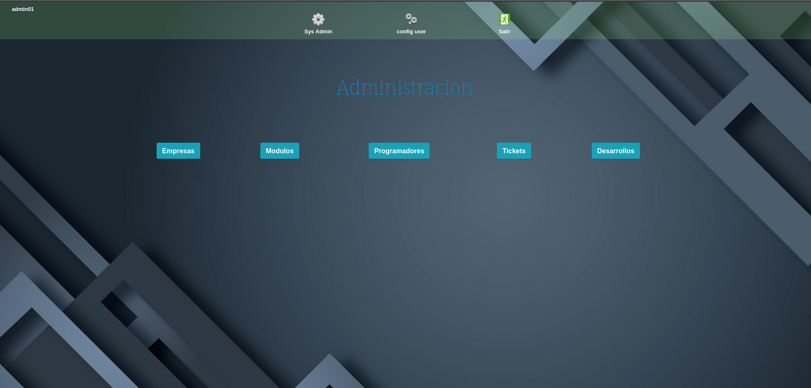
2. Listado de Empresas 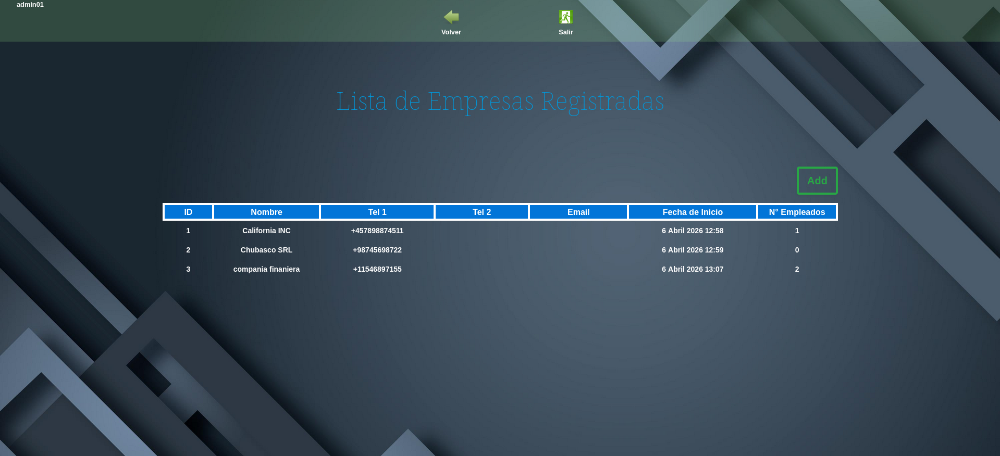
3. Detalle de una Empresa 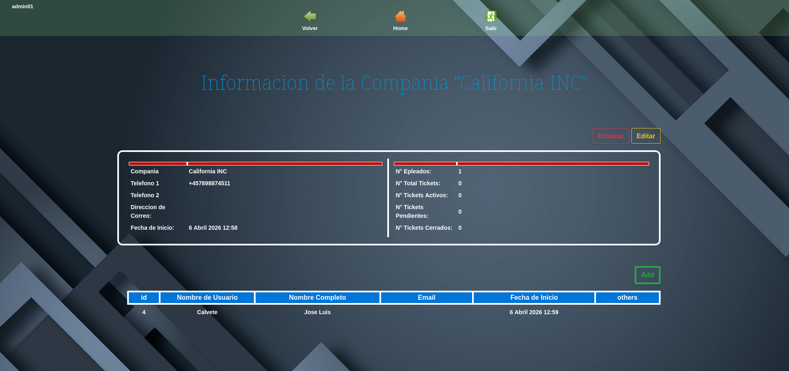
4. Listado de Modulos 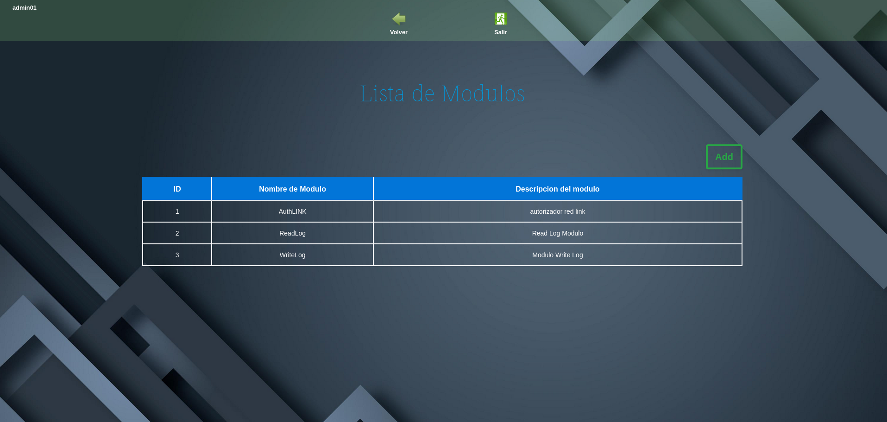
5. Edicion de un Modulo 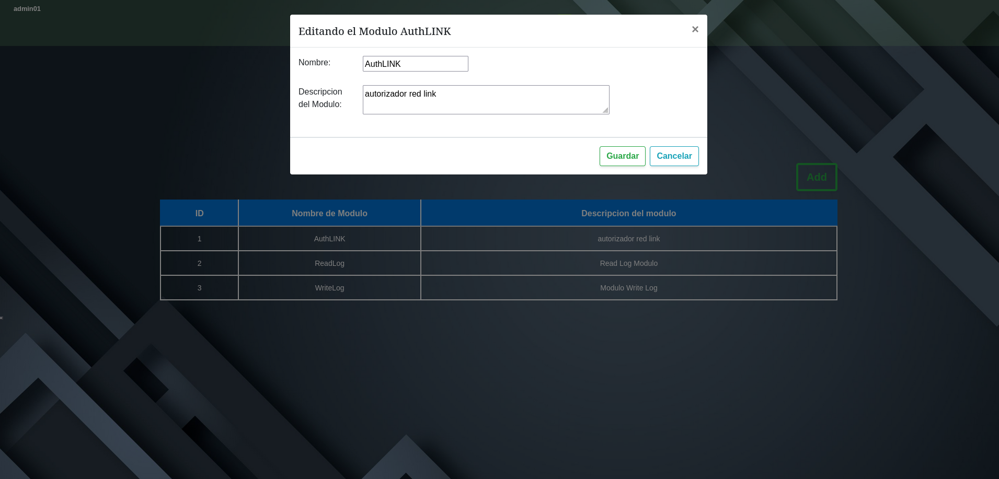
6. Listado de Programadores 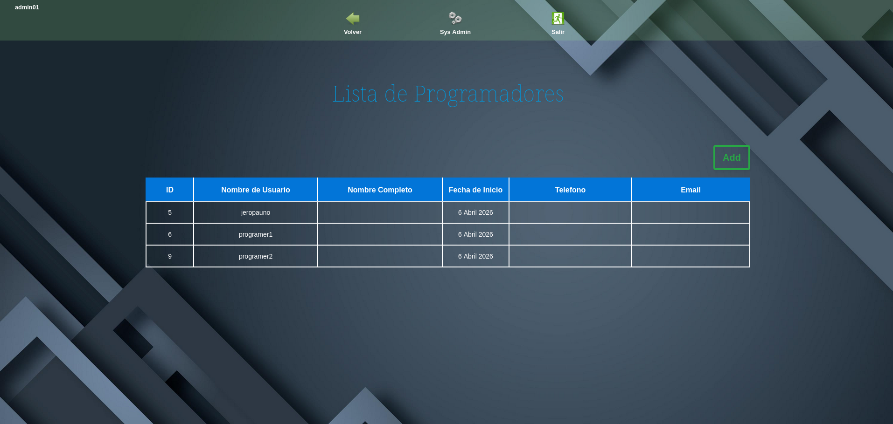
7. Listado de Tickets 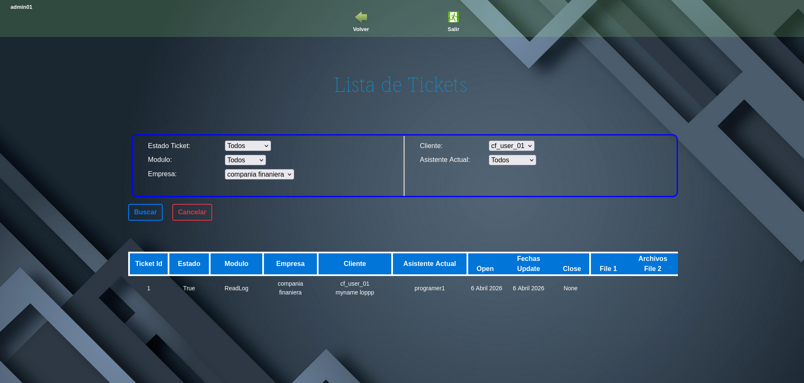


## Cliente
Se corresponde a una empresa, y estos son los que pueden dar de alta cada uno de los ticket como asi tambien dejar mensajes en cola para que el programador que los atiene pueda responder sobre el mismo hilo.

1. Home de un Cliente sin Tickets Creados 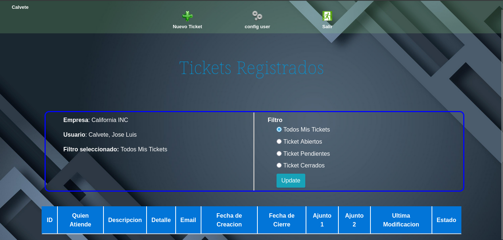
2. Home de Cliente con tickets 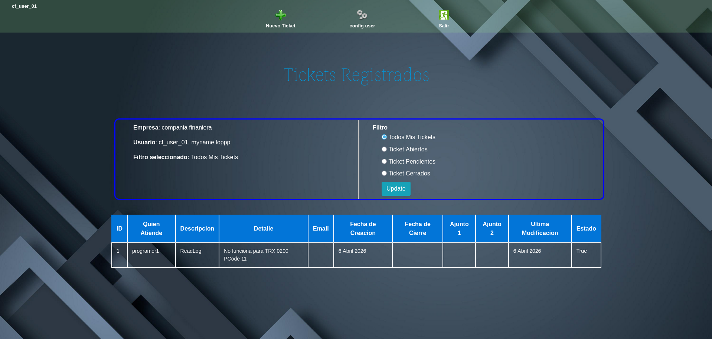

## Programador
Es el encargado de atender los Ticket y las Ordenes de tranajo que le fueron asignadas. En cuanto a los ticket puede visualizar y asignarselo. En cambio las ordenes de trabajo solo ver y si la tiene asignadas cargar la info correspondiente sobre estos.

1. Home de un Programador con ticket Asignado 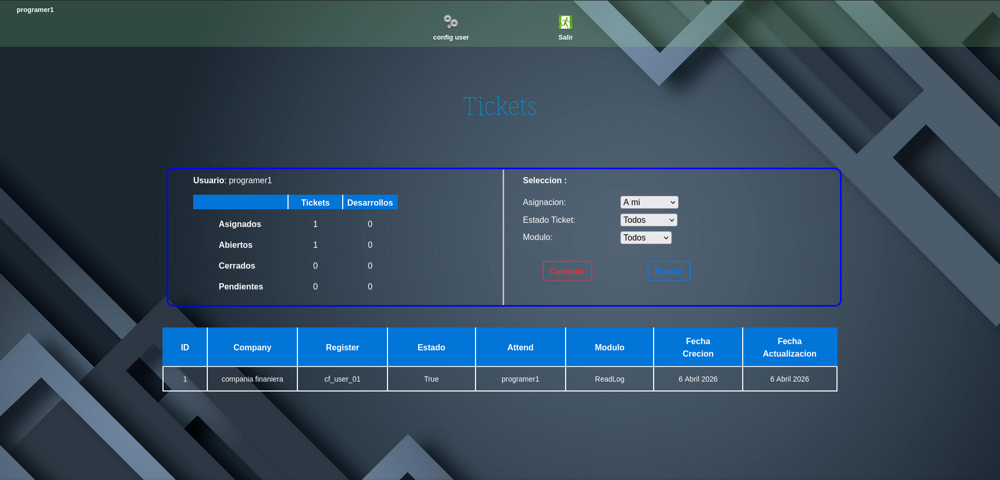

